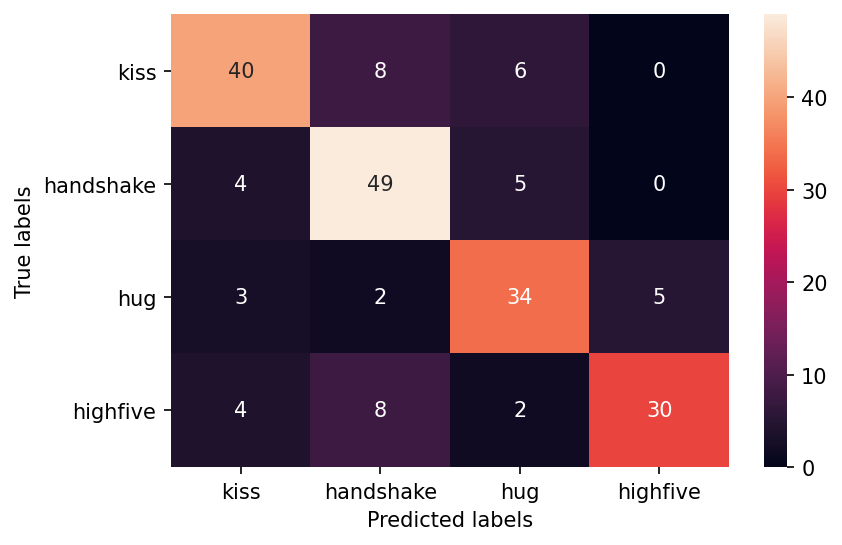
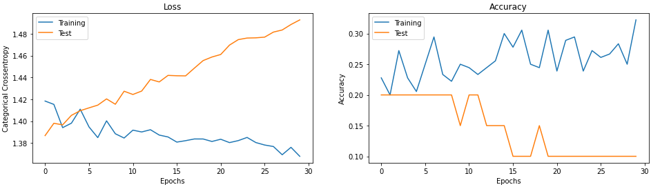
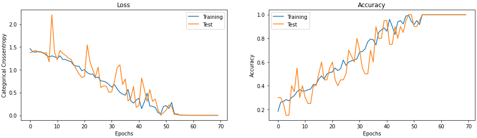
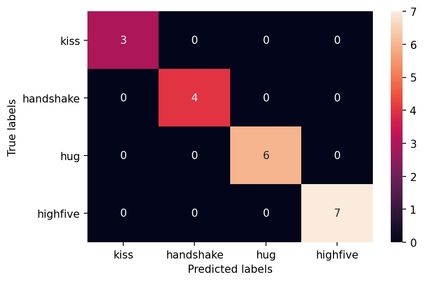

# pose-classification

This repo uses [OpenPose](https://github.com/CMU-Perceptual-Computing-Lab/openpose) and Machine Learning for pose classification based on [TV human interactions dataset](https://www.robots.ox.ac.uk/~vgg/data/tv_human_interactions/). 

### OpenPose

OpenPose algorithm implemented in Python is used for feature extraction from videos. 
[Forked OpenPose in TensorFlow library](https://github.com/jegork/tf-pose-estimation)

### Task

The goal of this project is to find the difference in accuracy of video classification using different Deep Learning techniques.

The proposed options are:
1. Long Short Term Memory based on features generated by OpenPose
2. 2D Convolutional Network based on features generated by OpenPose
3. VGG16 + LSTM trained directly on raw frames
4. 2D ConvNet with LSTM (directly) 
5. 3D ConvNet (directly) (isn't implemented due to computational limitations)

### Project structure

- utils.py contains functions that download and structure (per directories) the videos
- process_video.py contains functions for feature extraction using OpenPose
- main.ipynb utilizes the previous two python files
- openpose_lstm.ipynb implements algorithm #1
- vgg_lstm.ipynb implements algorithm #3
- 2dcnn_lstm.ipynb implements algorithm #4

### Results

| Model               | Training (%) | Test(%) |
| ------------------- | ------------ | ------- |
| OpenPose-based (#1) | 33           | 25      |
| VGG16-based (#3)    | 100          | 100     |
| CNN-based (#4)      | 80           | 75      |

<figure>
    
    <figcaption>Figure 1. Confusion matrix of CNN-based model</figcaption>
</figure>

<figure class="image">
    
    <figcaption>Figure 2. Training of OpenPose-based model</figcaption>
</figure>

<figure class="image">
    
    <figcaption>Figure 3. Training of VGG16-based model</figcaption>
</figure>

<figure class="image">
    
    <figcaption>Figure 4. Training of VGG16-based model</figcaption>
</figure>
